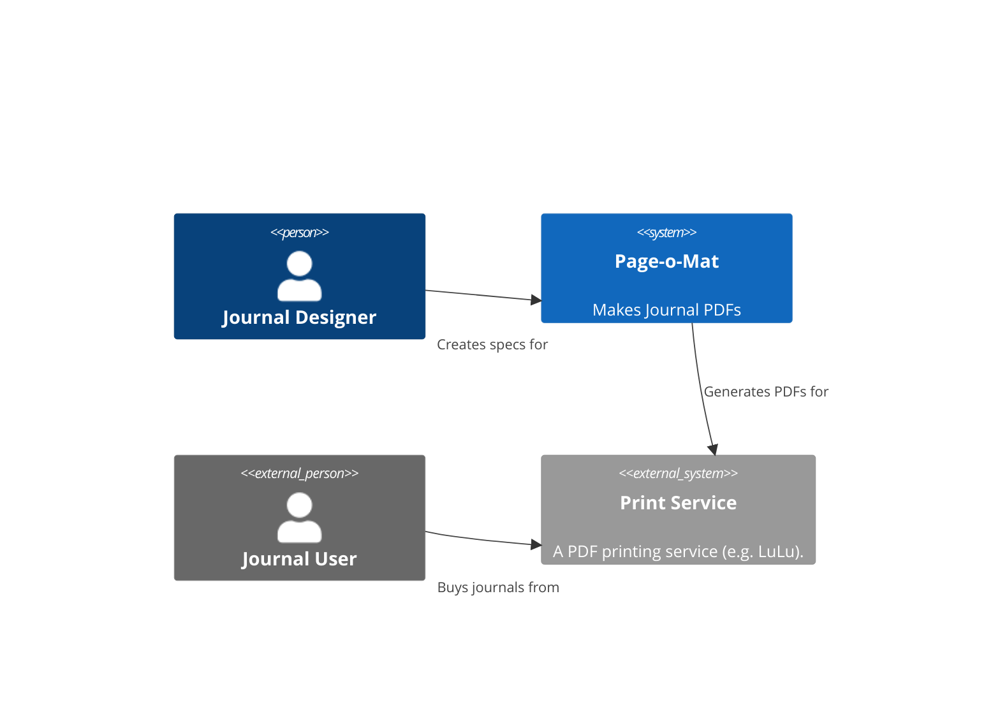

# Page-o-Mat Journal Generator

Generates a journal/planner (PDF) from a specification. Suitable for printing into a book or using on a tablet.

It was created to generate the 2023 daily journal described in https://loufranco.com/blog/recurring-journals.

In 2024 ([for my 2025 journal](https://loufranco.com/blog/my-2025-journal-pdf-for-supernote-a5)), I added support for internal links so I could make a electronic version of the journal for use on a Supernote Manta A5 sized e-ink tablet.

Configuration files for all of my journals are in the `config` folder.

# Documentation
This is a C4 System Context diagram for the Page-o-Mat system. Blue boxes are part of the system and gray boxes are shown for context.



[Full docs](docs)

# Setup

There is a requirements file to install dependencies. Using `pip`, you can run

```bash
$ pip install -r requirements.txt
```

# Usage

```bash
$ python pageomat/main.py -h
usage: main.py [-h] --config CONFIG --output OUTPUT

Runs Page-o-Mat

options:
  -h, --help       show this help message and exit
  --config CONFIG  name of the journal YAML config file
  --output OUTPUT  name of the pdf file

$ python pageomat/main.py --config config/2024-recurring-journal.yaml --output 2024.pdf
```

Sample configuration files can be found in the `config` folder.
